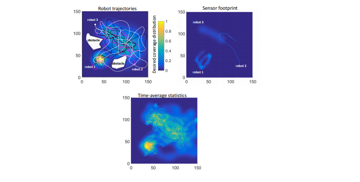

# STOEC
This repository contains codes for the IROS2017 paper [Ergodic Coverage In Constrained Environments Using Stochastic Trajectory Optimization](http://biorobotics.ri.cmu.edu/papers/paperUploads/1707.04294.pdf).

**A Python version of the code can be found in the following repository [stoec-python](https://github.com/Hadisalman/search-coverage/tree/stoec).**

## Summary
In search and surveillance applications in robotics, it is intuitive to spatially distribute robot trajectories with respect to the probability of locating targets in the domain.
Ergodic coverage is one such approach to trajectory planning in which a robot is directed such that the percentage of time spent in a region is in proportion to the probability of locating targets
in that region. In this work, we extend the ergodic coverage algorithm to robots operating in constrained environments and present a formulation that can capture sensor footprint
and avoid obstacles and restricted areas in the domain. We demonstrate that our formulation easily extends to coordination of multiple robots equipped with different sensing capabilities to perform ergodic coverage of a domain.

## Video
The video in the repository shows simulation of each figure in the paper. Also checkout the application of stoec to a [quadrotor coverage ](https://www.youtube.com/watch?v=ij7dZU_yoRI) problem by H.Salman using Airsim. 

## How to run
Each folder corresponds to an example/section in the paper. Each folder contains a `main_CE.m` file which contains the main code. Run `main_CE.m` of each folder to get the results of the corresponding section presented in the paper!

## Contact
In case you have any question or clarification, or in case you want to report a bug or suggest improvements, please contact:

* Elif Ayvali (eayvali at gmail.com)
* Hadi Salman (hadicsalman at gmail.com)
